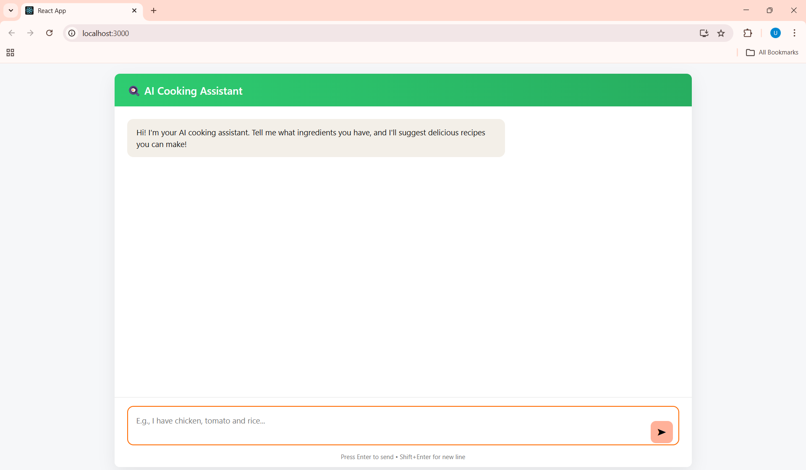
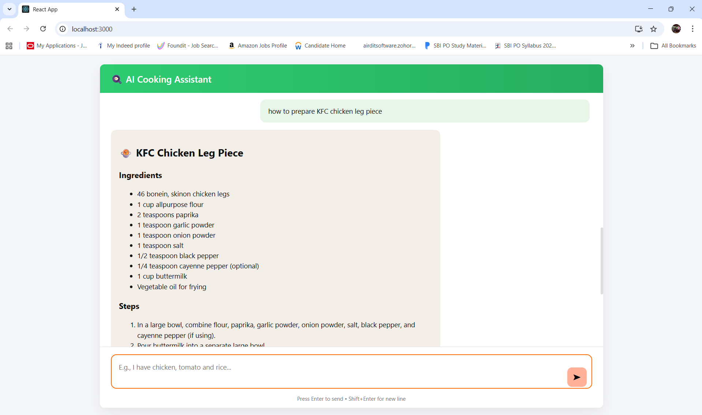
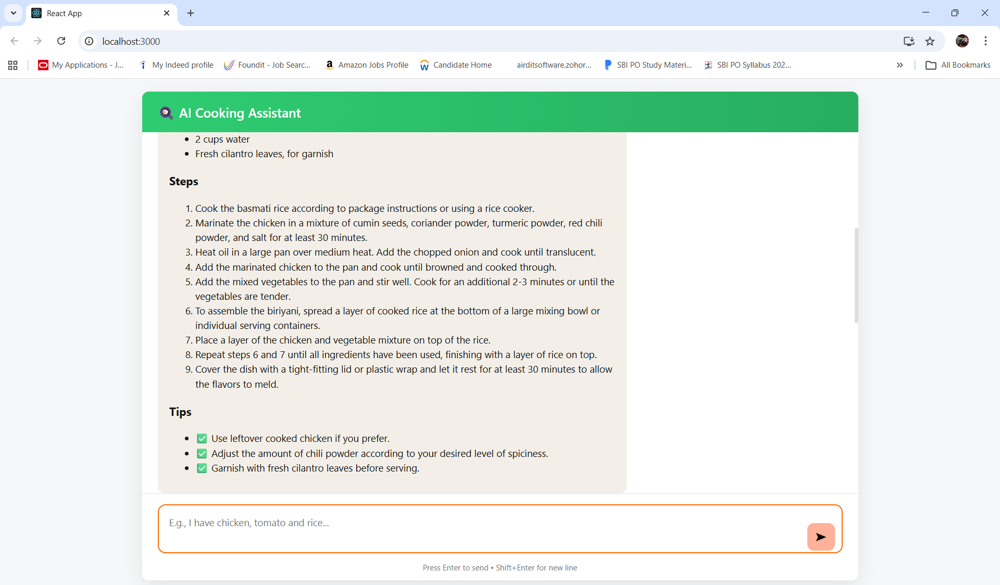
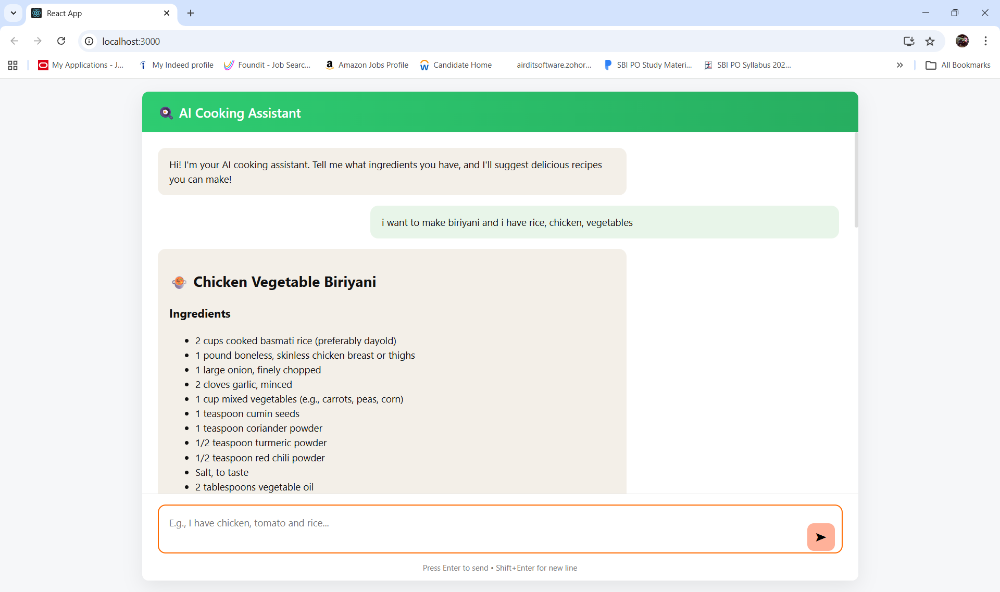

# 🍳 AI Cooking Assistant — LLM Powered Recipe Generator

An intelligent **AI Cooking Assistant** that generates structured recipes based on user ingredients using a locally running Large Language Model (LLM).
The application provides a modern chat interface and converts AI responses into beautifully formatted recipe cards.

---

##  Project Overview

The AI Cooking Assistant helps users discover recipes instantly by simply describing available ingredients or desired dishes.

Unlike traditional chatbots, this system:

* Uses a **local LLM (Llama3 via Ollama)** for privacy and offline capability
* Enforces structured recipe formatting
* Converts AI responses into clean UI components
* Provides a real-time conversational cooking experience

---

## ✨ Features

* AI-powered recipe generation
* Structured recipe output (Dish, Ingredients, Steps, Tips)
* Beautiful recipe card UI
* Real-time chat interface
* Auto-scroll conversation view
* Fault-tolerant response parser
* Local AI execution (No cloud dependency)
* Fast Express.js API backend

---

## System Architecture

```
React Frontend  →  Express API  →  Ollama (Llama3 LLM)
        UI              Backend          AI Model
```

### Flow:

1. User enters ingredients or recipe request.
2. React sends request to Express backend.
3. Backend forwards prompt to Ollama LLM.
4. LLM generates structured recipe.
5. Frontend parses response and renders recipe cards.

---

## Tech Stack

### Frontend

* React.js
* JavaScript (ES6)
* CSS3
* Fetch API

### Backend

* Node.js
* Express.js
* CORS Middleware

### AI / LLM

* Ollama
* Llama3 Model
* Prompt Engineering

---

## 📂 Project Structure

```
AI-Cooking-Assistant
│
├── backend/
│   ├── server.js
│
├── frontend/
│   ├── src/
│   │   ├── App.js
│   │   ├── App.css
│
├── README.md
└── assets/
    ├── chat-ui.png
    ├── recipe-output.png
    ├── recipe-card.png
    └── multiple-recipes.png
```
##  Application Preview

###  Chat Interface



---

### 🍲 AI Generated Recipe



---

###  Structured Recipe Card UI



---

###  Multiple Recipe Conversation



---

## ⚙️ Installation & Setup

### 1️⃣ Clone Repository

```bash
git clone https://github.com/your-username/ai-cooking-assistant.git
cd ai-cooking-assistant
```

---

### 2️⃣ Install Backend Dependencies

```bash
cd backend
npm install
```

---

### 3️⃣ Install Frontend Dependencies

```bash
cd frontend
npm install
```

---

### 4️⃣ Install Ollama & Model

Install Ollama:

👉 https://ollama.com

Run:

```bash
ollama pull llama3
ollama serve
```

---

### 5️⃣ Start Backend

```bash
node server.js
```

Server runs on:

```
http://localhost:5000
```

---

### 6️⃣ Start Frontend

```bash
npm start
```

App runs on:

```
http://localhost:3000
```

---

## 🧾 Example Usage

**User Input**

```
I have paneer, tomato and butter
```

**AI Output**

* Dish Name
* Ingredients List
* Step-by-step Cooking Instructions
* Cooking Tips

Displayed as a structured recipe card.

---

## 🧩 Key Technical Highlights

* Prompt engineering for deterministic LLM output
* Custom parser converting AI text → structured UI
* Error handling & fallback formatting
* Clean component-based React architecture
* Local AI inference for enhanced privacy

---

## 📈 Future Enhancements

*  Voice input cooking assistant
*  Multilingual recipe generation
*  AI-generated food images
*  Progressive Web App (PWA)
*  Text-to-Speech cooking guide
*  Save favorite recipes

---

## Author

**Umesh Nayak**
Computer Science Engineer | Full-Stack Developer | AI Enthusiast

* LinkedIn: https://linkedin.com/in/umeshlnayak
* GitHub: https://github.com/UmeshNayak1/

---
